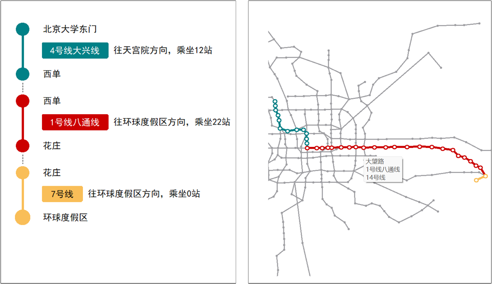
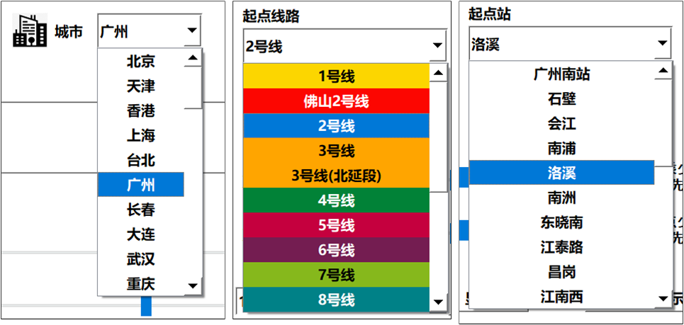

# 基于Qt实现的可视化地铁换乘系统

## 简介

基于C++结合Qt5实现了基本的地铁换乘方法搜索过程。

实现了中国大陆**所有城市**的任意相连站点的地铁换乘路线搜索，城市列表在`city/cityIndex.csv`中

## 实现方法

- 使用Python进行获取[高德地图地铁图](http://map.amap.com/subway/)相关信息
- 使用加权Dijkstra算法，结合站点之间的距离，设计最为合理的换乘路线
- 使用Qt作为前端展示，提供换乘路线和换乘地图两种展示方法。

## 实现展示

